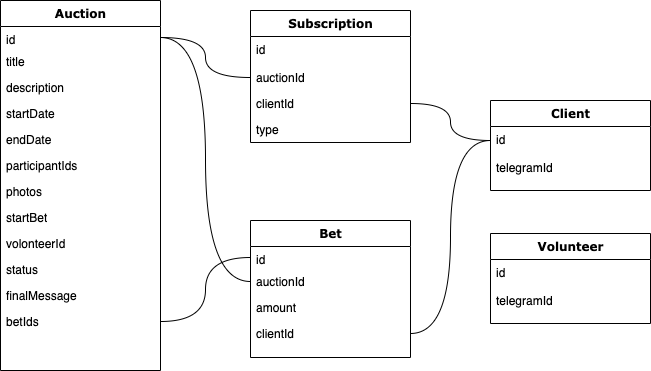

## hackaton-auction
### links

[t.me/hackaton_auction_admin_bot](https://t.me/hackaton_auction_admin_bot)
[t.me/hackaton_auction_bot](https://t.me/hackaton_auction_bot)

### DB Schema


### Services/API
```js
// check if the creator is in white list
// Auctions
function createAuction(auction: Auction)
function updateAuction(auctionId: string, auction: Partial<Auction>)
function closeAuction(auctionId: string)
function getAuctionDetails(auctionId: string)
function notifySubscribers(auctionId: string, type: SubscriptionType)
function getTopBet(auctionId: string)
function getAllBets(auctionId: string)

// Bets
function createBet(amount: number, auctionId: string)
```

### How to start local env for dev
```shell
#from repo root
yarn
yarn build

#from bot folder
docker-compose up -d
yarn start:dev
```